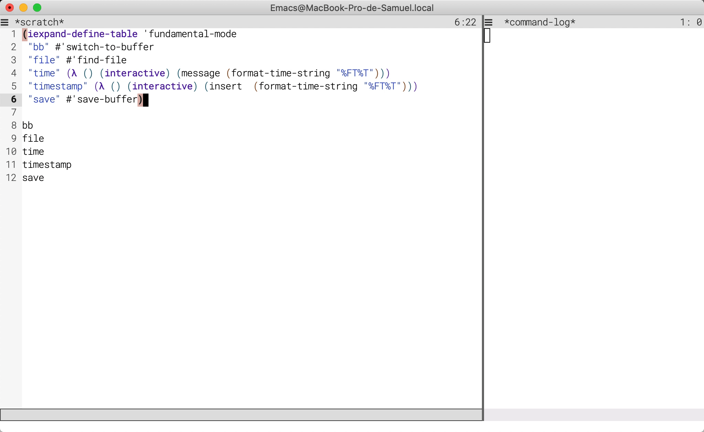

## iexpand.el
*Expand commands at point*

---
[](http://www.gnu.org/licenses/gpl-3.0.html)

Add an expansion to hippie-expand that allows calling functions
from a typed symbol. This is cool because one can just type
a symbol, and call `hippie-expand`, which will trigger the command
if there is one associated with the symbol at point; the typed
symbol will be deleted, restoring buffer state.

Users can define expansion tables in the spirit of `abbrev`
tables — that is, in a per-mode fashion, respecting the hierarchy
of modes.

### Usage


```emacs-lisp
(require 'iexpand)
;; add `try-iexpand` to the list of hippie-expand functions
(iexpand-global-mode t)
(iexpand-define 'emacs-lisp-mode "eb" #'eval-buffer)
(iexpand-define 'prog-mode "compile" #'compile)
```

Now in an emacs-lisp buffer, typing `eb` and calling
`hippie-expand` (usually bound to `M-/`) will evaluate the buffer.
In that same buffer, as `emacs-lisp-mode` inherits from
`prog-mode`, typing `compile` and calling `hippie-expand` will
prompt for a compilation command (see `C-h C-f compile`).

One can also define multiple expansions in one run:

```emacs-lisp
(iexpand-define-table 'text-mode
 "xs" #'save-buffer
 "ir" #'indent-region
 "indent-region" #'indent-region
 "indent" #'indent-region)

;; define global expansions by adding to the fundamental-mode table
(iexpand-define-table 'fundamental-mode
 "bb" #'switch-to-buffer
 "file" #'find-file
 "time?" (lambda () (interactive) (message (format-time-string "%FT%T")))
 "time!" (lambda () (interactive) (insert  (format-time-string "%FT%T"))))

```

See it in action:



> (For those who care, theme is a combination of [modus
operandi](https://gitlab.com/protesilaos/modus-themes)
and [elegance.el](https://github.com/rougier/elegant-emacs); font
is *Roboto mono*.)

### Function Documentation


#### `(iexpand-define-table MODE &rest BODY)`

Wrapper around ‘iexpand-define’ for defining multiple KEY-COMMAND expansions.

BODY consists of KEY-COMMAND pairs.

Example:
(iexpand-define-table ’emacs-lisp-mode
  "xs" #’save-buffer
  "hw" (lambda (interactive) (message "hello world")))

#### `(iexpand-define MODE KEY COMMAND)`

Define an expansion for COMMAND associated with KEY for MODE.

Calling ‘hippie-expand’ when point is after KEY in major-mode
MODE triggers calling COMMAND interactively.

#### `(turn-on-iexpand-minor-mode)`

Simple wrapper around ‘iexpand-minor-mode’

-----
<div style="padding-top:15px;color: #d0d0d0;">
Markdown README file generated by
<a href="https://github.com/mgalgs/make-readme-markdown">make-readme-markdown.el</a>
</div>
